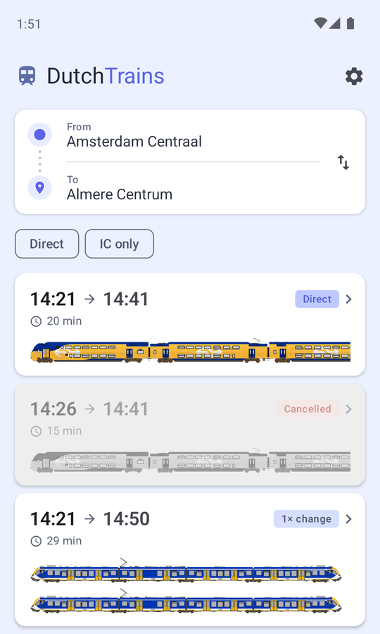
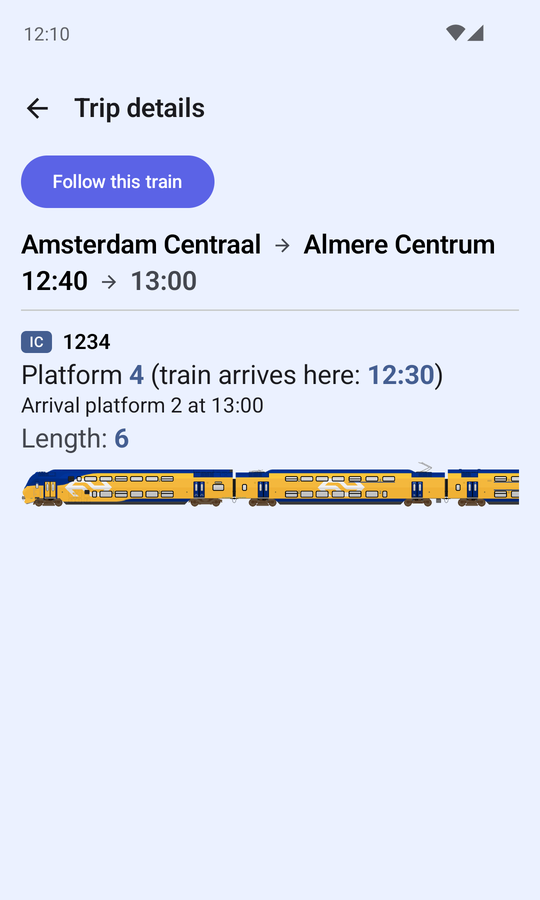
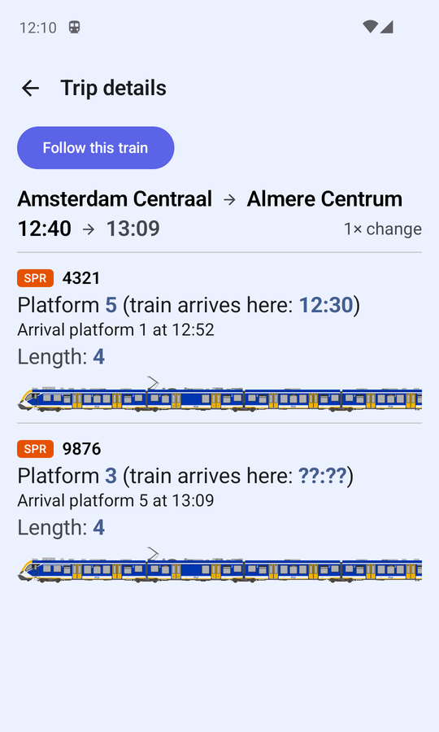
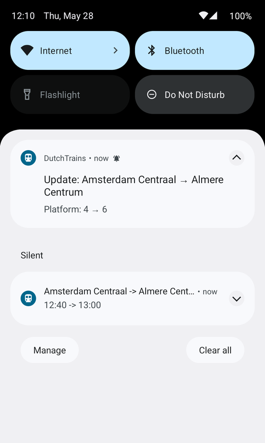

# Dutch Trains

Android app for checking NS train departures and following live train journeys.

Dutch Trains is intentionally a power-user commuter app: it focuses on high-signal operational details and fast
decision making while traveling.

## Features

- Search trips between any two Dutch stations
- View trip details: departure/arrival times, platform, duration, and rolling stock
- See departure-track arrival timing (when the train is expected to arrive at your platform)
- See train length and composition to help pick better boarding positions
- Follow a trip — a background service tracks it and notifies you of platform changes, delays, and arrival times
- Receive push notifications for any tracked-trip change while commuting
- Nearest station detection via GPS

## Screenshots

<table>
  <tr>
    <td></td>
    <td></td>
  </tr>
  <tr>
    <td></td>
    <td></td>
  </tr>
</table>

## Requirements

- Android 8.0+ (API 26)
- An [NS API key](https://apiportal.ns.nl/) (free, requires registration)

## Getting started

1. Clone the repo
2. Open in Android Studio
3. Run the app on a device or emulator
4. Enter your NS API key in Settings on first launch

## Configuration

The NS API key is stored in `local.properties` for local development (not committed):

```
NS_API_KEY=your_key_here
```

The app also reads it from a `.env` file in the repo root, which is used by the dev container setup.

## Building

```sh
# Debug APK
./scripts/build-debug.sh

# Or directly
./gradlew assembleDebug
```

The output APK is at `app/build/outputs/apk/debug/app-debug.apk`.

### Release build (F-Droid compatible)

```sh
./gradlew clean :app:assembleRelease
```

Notes:
- The app does not require secrets at build time.
- NS API key is user-provided in-app at runtime.
- The release artifact is generated at `app/build/outputs/apk/release/`.

## Testing

```sh
# Instrumented tests (requires a connected device or running emulator)
./scripts/run-tests.sh

# Or directly
./gradlew connectedDebugAndroidTest
```

The instrumented test suite uses a `MockWebServer` in place of the real NS API, so no API key is needed.

To run the full local test process (JVM + ordered instrumented suites):

```sh
bash ./scripts/run-tests.sh
```

The script runs:
1. `./gradlew test`
2. permission-flow instrumented tests
3. main-flow instrumented tests

## F-Droid publishing notes

- Ensure release tags and version codes are incremented for each release.
- Build using `:app:assembleRelease` from a clean checkout.
- Use this repo's source tarball/tag as the build source.
- Keep dependencies and Gradle plugin versions pinned in source control.

To capture/update these screenshots:

```sh
bash ./scripts/generate-readme-screenshots.sh
```

## Tech stack

- Kotlin + Jetpack Compose
- Hilt (dependency injection)
- Retrofit + OkHttp + kotlinx.serialization (networking)
- DataStore (preferences)
- Foreground service for live trip following
- UiAutomator2 + Hilt for instrumented tests
